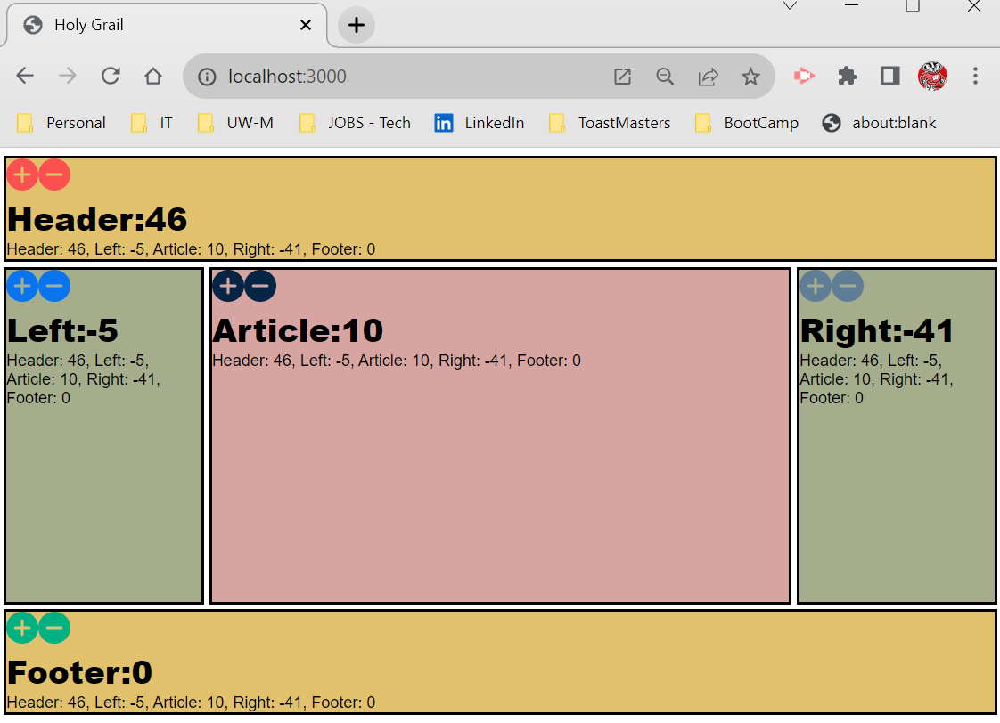

# **Project Name**:

Holy Grail

# **Description**:
This is a standalone React.js app in which the state of each component (header, footer, article, left, right) is communicated with the other components. The user can click on the +/- icons in each component to change the numbers of each component. 

This is a three-tier app: React, SuperAgent, and a browser for the client side (Front-End); NodeJS and Express on the server side (Back-End); and Docker as a containerization solution with Redis serving as the data store (Data Storage).

The app highlights my capabilities in HTML5, CSS, Javascript, Babel, SuperAgent, various libraries, React, Node.js, npm, Express, Docker, and Redis. This is my first attempt at using Redis as the database to integrate into the third tier of the app. Redis is run on top of Docker. Its another example of my initial steps into full stack development. In creating this project, I considered the hierarchy of the components and how I wanted to design the architecture. As is this only works on my local machine, but I suspect we will be returning to this project in the near future to enhance it and then share it publicly. I worked on this particular exercise in November of 2023, during module 25 from the MIT xPro via Emeritus bootcamp I was enrolled in called "Professional Certificate in Coding: Full Stack Development with MERN."

# **Dependencies**: 
The exercise relies on the following dependencies: Babel, Express, Redis. NOTE: The latest version of Redis is not compatible with the code. I used version 4.0.1.

# **Usage**:
To run my project on your machine, download the files onto your machine or clone the repo. 
* Phase 1:
* Ensure http-server package is installed on your system. You may need to type in the terminal: npm install http-server or navigate to the project directory and type in the terminal: npm install -g http-server
* Type terminal command: http-server -c-1
* In a browser type address: http://localhost:8080. The holy grail web design layout structure will be displayed.
* Type terminal command: Ctrl + C
* Phase 2:
* (Make sure to navigate to the root directory, above the public folder.) Type terminal command: npm init
* Type terminal command: npm install
* Type terminal command: node index.js
* Type terminal command: Ctrl + C
* Phase 3:
* Open Docker app on your computer.
* (In project folder) Type terminal command: docker run -p 6379:6379 --name some-redis -d redis:4.0.1
* Optional: To verify you are running a container on Docker, type terminal command: docker ps
* Type terminal command: node key_get_set.js
* Type terminal command: Ctrl + C
* Phase 4:
* Type terminal command: node index.js
* Enter the routes to verify functionality by typing the following addresses in a browser: 
* http://localhost:3000\data
* http://localhost:3000\update\header1
* In a browser type address: http://localhost:3000
* Click on the + / - icons and watch the numbers change with each click.
* When finished working with the project, close the Docker container by typing in terminal command: docker rm some-redis
* When finished working with the project, close the port by typing in terminal command: Ctrl + C

# **Support**: 
Please contact me via email at krentmeester@uwalumni.com.

# **Roadmap**: 
I likely future improvement to this as a "project" would be:
* Add actual content to the componenets.

# **License**: 
MIT License

Copyright (c) 2023 Kerri Rentmeester

Permission is hereby granted, free of charge, to any person obtaining a copy of this software and associated documentation files (the “Software”), to deal in the Software without restriction, including without limitation the rights to use, copy, modify, merge, publish, distribute, sublicense, and/or sell copies of the Software, and to permit persons to whom the Software is furnished to do so, subject to the following conditions:

The above copyright notice and this permission notice shall be included in all copies or substantial portions of the Software.

THE SOFTWARE IS PROVIDED “AS IS”, WITHOUT WARRANTY OF ANY KIND, EXPRESS OR IMPLIED, INCLUDING BUT NOT LIMITED TO THE WARRANTIES OF MERCHANTABILITY, FITNESS FOR A PARTICULAR PURPOSE AND NONINFRINGEMENT. IN NO EVENT SHALL THE AUTHORS OR COPYRIGHT HOLDERS BE LIABLE FOR ANY CLAIM, DAMAGES OR OTHER LIABILITY, WHETHER IN AN ACTION OF CONTRACT, TORT OR OTHERWISE, ARISING FROM, OUT OF OR IN CONNECTION WITH THE SOFTWARE OR THE USE OR OTHER DEALINGS IN THE SOFTWARE.